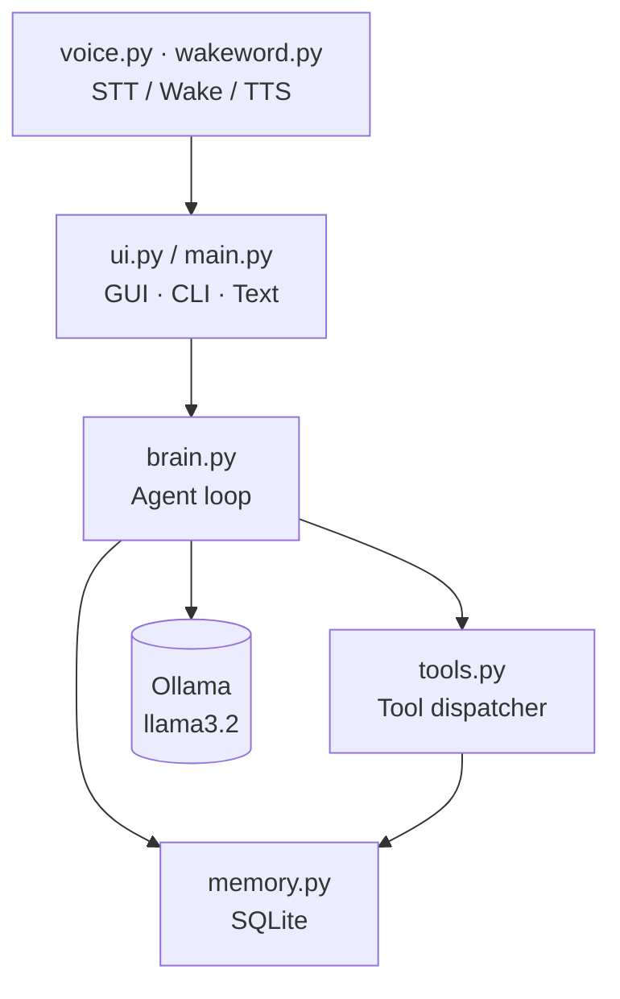
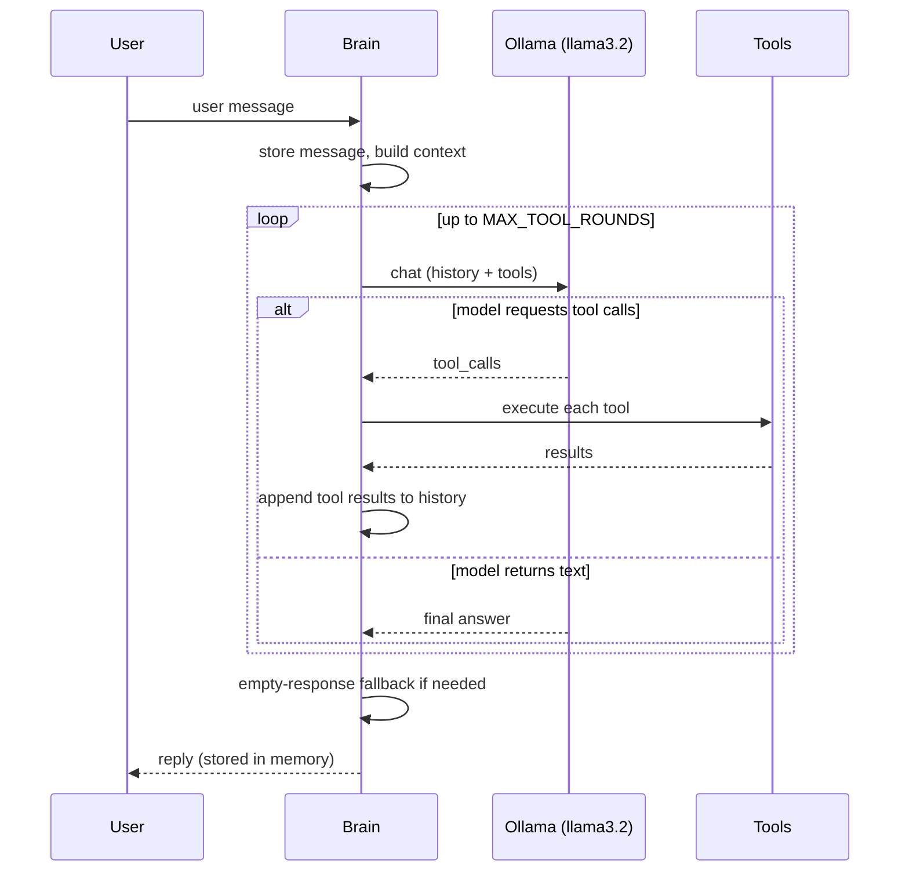
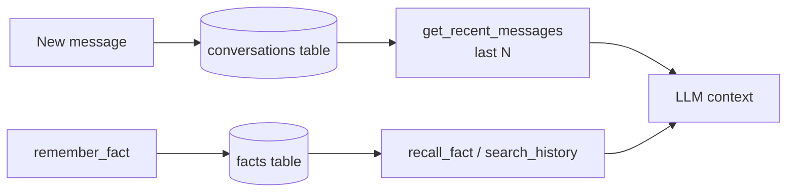
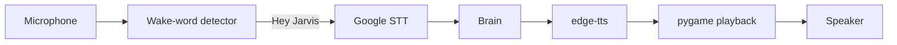

# Architecture

Jarvis is a local-first assistant served as a **web app** (FastAPI backend + a
single-page UI) with a legacy PyQt5 desktop mode still available. The language
model is pluggable: a local [Ollama](https://ollama.com) `llama3.2` by default, or
any OpenAI-compatible cloud endpoint via `LLM_PROVIDER=openai_compatible`. The web
layer **wraps** the existing `brain.py` / `tools.py` / `memory.py` rather than
reimplementing them.

## Web application

```mermaid
flowchart TD
    SPA[webapp/ SPA<br/>chat · voice · files · memory] -->|HTTP + WebSocket<br/>127.0.0.1 only| Srv[server.py · FastAPI]
    Srv -->|/chat, WS /stream| Brain[JarvisBrain]
    Srv -->|/files/*| Tools[file tools]
    Srv -->|/memory/*| Mem[(SQLite)]
    Launcher[run.py / Jarvis.exe] -->|start + open browser when healthy| Srv
    Brain --> LLM[(Ollama | cloud)]
    Brain --> Tools
    Brain --> Mem
```

- **`server.py`** exposes `GET /health`, `POST /chat`, `WS /stream` (live
  tool-activity events), `GET|DELETE /memory/facts`, `POST /memory/clear`, and the
  `/files/*` workspace endpoints, and serves the SPA at `/`.
- **`run.py`** picks a free loopback port, starts uvicorn, polls `/health`, and
  opens the browser. It is the PyInstaller entry point (`jarvis.spec` → `Jarvis.exe`).
- **Provider switch:** `config.py` resolves `LLM_PROVIDER` into `LLM_BASE_URL` /
  `LLM_API_KEY` / `LLM_MODEL`; `brain.py` reads only those, so swapping providers
  is an env change.
- **`stream_turn`** in `brain.py` yields `tool` / `tool_result` / `final` events;
  `think` drains it for the non-streaming `/chat` path.

The sections below describe the shared assistant core used by both the web app and
the legacy desktop modes.

## Layers

| Layer | Module | Responsibility |
|-------|--------|----------------|
| **GUI** | `ui.py` | PyQt5 window, chat bubbles, voice/text input, worker threads |
| **Entry / CLI** | `main.py` | GUI / `--cli` / `--text` launch modes |
| **Voice** | `voice.py`, `wakeword.py` | STT (Google), wake-word detection, TTS (edge-tts + pygame) |
| **LLM / Agent** | `brain.py` | Chat loop, multi-round tool calling, fallbacks |
| **Tools** | `tools.py` | Tool implementations + JSON schemas + dispatcher |
| **Memory** | `memory.py` | SQLite short-term history and long-term facts |
| **Config** | `config.py` | Env-driven settings and the system prompt |



## Assistant flow (one turn)

The brain runs a real agentic loop. The model may request tool calls; results
are fed back as `tool` messages and the model decides whether it needs more
tools or is ready to answer. The full message history (system prompt + recent
turns + tool requests + tool results) is preserved across every round, capped by
`MAX_TOOL_ROUNDS`.



## Memory flow

Short-term memory is the last `CONTEXT_WINDOW` messages, replayed to the model
each turn. Long-term memory is a key/value `facts` table the model reaches
through the `remember_fact` / `recall_fact` / `search_history` tools.



## Voice flow



A shared `mic_lock` (in `voice.py`) guarantees the wake-word detector and the
`listen()` capture never open the microphone at the same time. The GUI also
tears down a running voice worker — and waits for its thread to exit — before
starting a new voice or text worker, so PyAudio never sees two concurrent
microphone clients.

## Threading model (GUI)

- `JarvisWorker` — long-running wake → listen → think → speak loop.
- `JarvisTextWorker` — one-shot worker for a typed message.
- Both run off the Qt main thread and communicate via signals
  (`state_changed`, `new_message`, `error_occurred`).
- Switching between voice and text always routes through
  `_terminate_voice_worker()`, which stops the worker and blocks until the
  thread has fully exited before the next worker starts.
